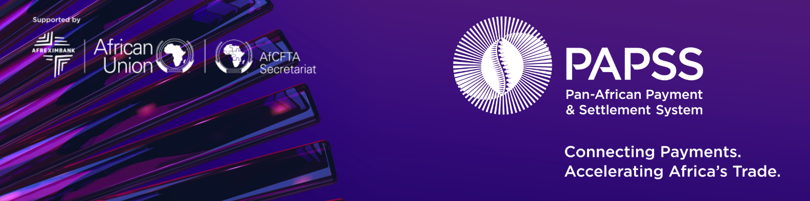

# Welcome to PAPSS Developer Platform

---

#### Everything you need to know about our APIs;
#### Integration Guidelines,
#### API Documentations,
#### Certification
#### and Support

## Introduction
PAPSS offers 2 forms of integration:
1. Through Java Client Library
2. Through REST API Gateway that is deployed on the participant's environment.

Operations that can be performed to the PAPSS System by Participants are as follows

- Credit Transfer (pacs.008.001)
- Credit Transfer Return (pacs.004)
- Recall Message (camt.056.007)
- Negative Answer to recall (camt.029.001)
- Request to Pay (pain.013.001)
- Request to Pay response (pain.014.001)
- Investigation (pacs.028.001)
- Identification modification Advice (acmt.022.001)
- Identification verification Request (acmt.023.001)
- Identification verification Report (acmt.024.001)
- Modification message (camt.007.002)
- Net Position information (position.001.xsd)
- Settlement message (rcon.001.xsd)
- Participant Status
- GetEscrow Transaction
- GetFXRate.

